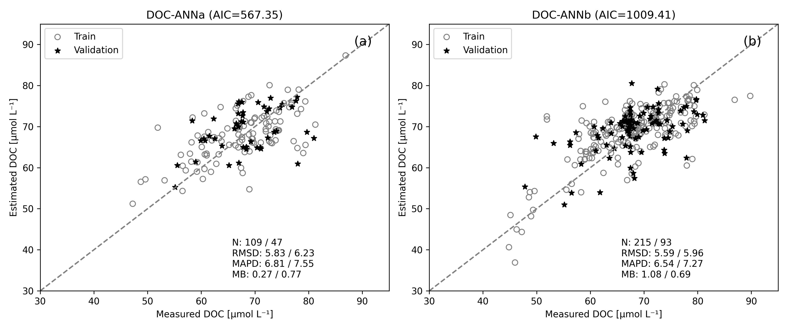
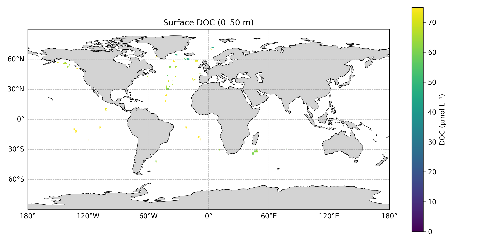

# DOC Neural Network Model for Ocean Remote Sensing

**Author:** Ana Gabriela Bonelli

## Associated publication:
Ana Gabriela Bonelli, Hubert Loisel, Daniel S.F. Jorge, Antoine Mangin, Odile Fanton d'Andon, Vincent Vantrepotte
*A new method to estimate dissolved organic carbon concentration from remote sensing in the global open ocean*
**Remote Sensing of Environment (2022)**
https://doi.org/10.1016/j.rse.2022.113227

---

## Overview

This repository provides a **reproducible machine learning pipeline** to estimate **Dissolved Organic Carbon (DOC)** from satellite-derived oceanographic variables.

The method is based on **neural networks trained on in situ and satellite data**, enabling global-scale DOC estimation for both coastal and open ocean waters.

---

## Inputs

The model uses the following satellite-derived variables:

* Chlorophyll-a (**CHL**)
* Sea Surface Temperature (**SST**)
* CDOM absorption at 443 nm (**CDOM**)
* Mixed Layer Depth (**MLD**)

---

## Models

Two neural networks are implemented:

* `DOCANNa` → optimized for **coastal waters**
* `DOCANNb` → optimized for **open ocean**


---

## 🧪 Model Evaluation

Evaluate model performance using matchup datasets:

```bash
python scripts/run_evaluation.py
```
Evaluation visualization:



Fig. 1. Scatter plots and statistics detailing the performance of (a) DOC-ANNa and (b) DOC-ANN models over the training (o) and validation (*) data sets. The solid line represents the 1:1

---

## Installation

```bash
conda create -n doc_env python=3.10
conda activate doc_env
pip install -r requirements.txt
```

---

## Run Inference

```bash
python scripts/run_inference.py
```

This generates:

```
outputs/doc_map.nc
```

---

## Example Output

Generate and visualize a DOC map:

```bash
python scripts/run_inference.py
python scripts/plot_map.py --output outputs/doc_map.png
```

Example visualization:



---

## Output

* NetCDF file containing DOC estimates
* 2D spatial maps (lat × lon)

---

## Reproducibility

This repository ensures full reproducibility:

* ✔️ Pretrained neural network models included
* ✔️ Feature scaling (`StandardScaler`) preserved
* ✔️ Sample input dataset provided
* ✔️ Configurable pipeline via `config.yaml`

---

## Methodological Notes

* Models are trained using standardized inputs
* Scaling parameters are derived from training datasets and reused during inference
* The pipeline supports batch processing of satellite products

---

## Repository structure

## 📂 Repository Structure

```
DOC-ANN/
│
├── README.md              # Project overview and usage instructions
├── LICENSE                # License information
├── requirements.txt       # Python dependencies
├── .gitignore             # Ignored files and directories
│
├── configs/
│   └── config.yaml        # Main configuration file
│
├── models/
│   ├── DOCANNa.h5
│   ├── DOCANNa_scaler.pkl
│   ├── DOCANNb.h5
│   └── DOCANNb_scaler.pkl
│
├── data/
│   └── sample/
│       ├── chl.nc
│       ├── sst.nc
│       ├── cdom.nc
│       └── mld.nc
│
├── outputs/
│   ├── doc_map.nc
│   └── doc_map.png
│
├── logs/
│   └── run_*.log
│
├── src/
│   └── doc_model/
│       ├── __init__.py
│       │
│       ├── data/
│       │   └── netcdf.py
│       │
│       ├── models/
│       │   └── inference.py
│       │
│       ├── pipeline/
│       │   └── runner.py
│       │
│       ├── utils/
│       │   ├── config.py
│       │   ├── logger.py
│       │   └── io.py
│       │
│       └── visualization/
│           └── plot.py
│
├── scripts/
│   ├── run_inference.py
│   └── plot_map.py
│
└── tests/
    └── test_inference.py
```


## Contact
Ana Gabriela Bonelli
📧 [agbonelli@gmail.com](mailto:agbonelli@gmail.com)
